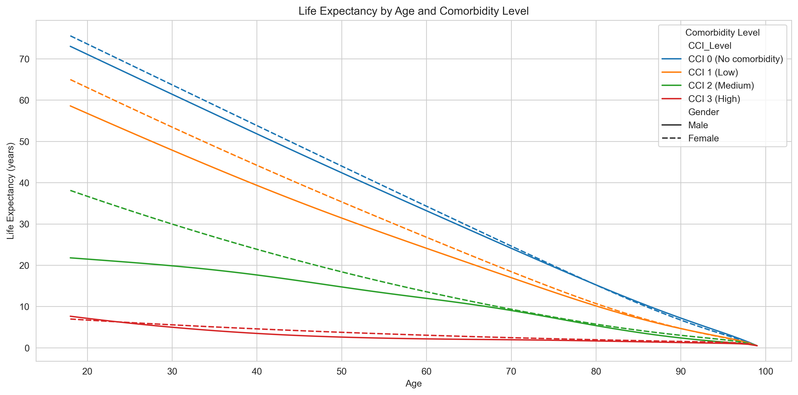
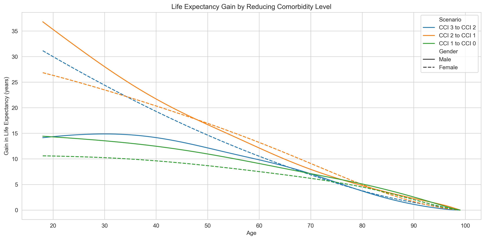
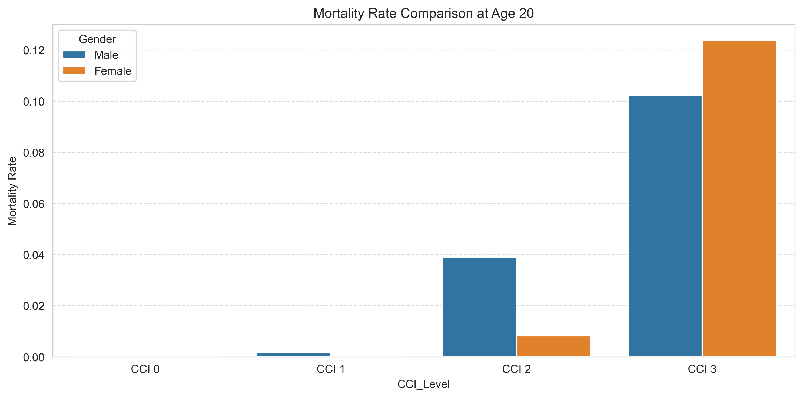
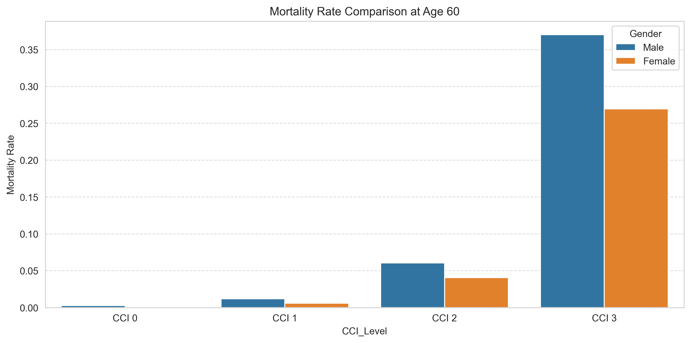
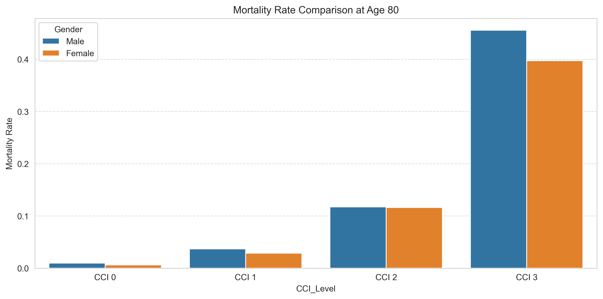
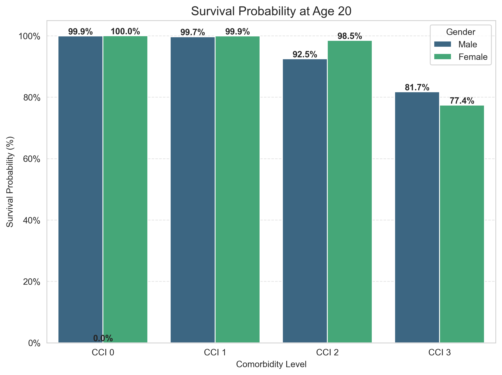
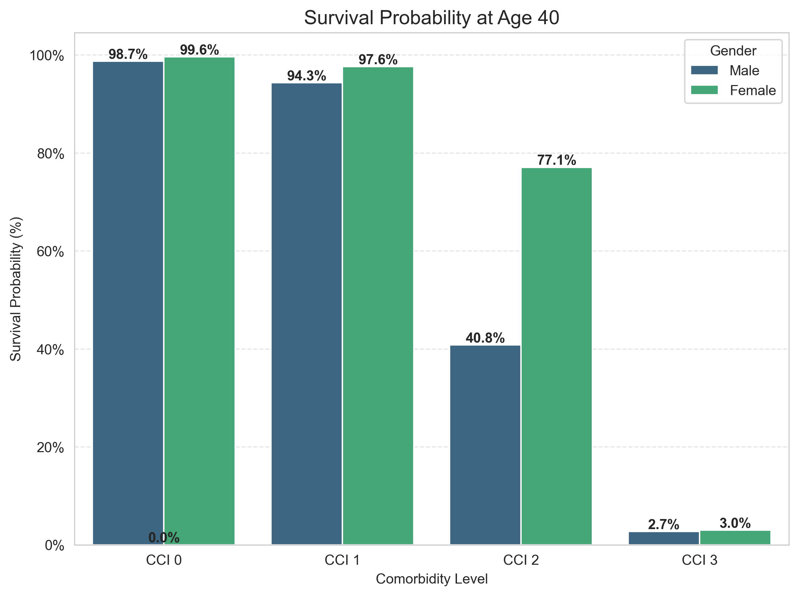
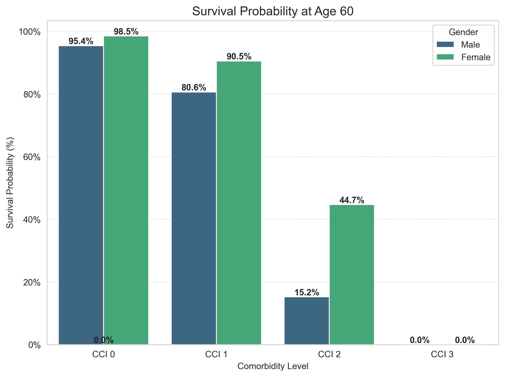
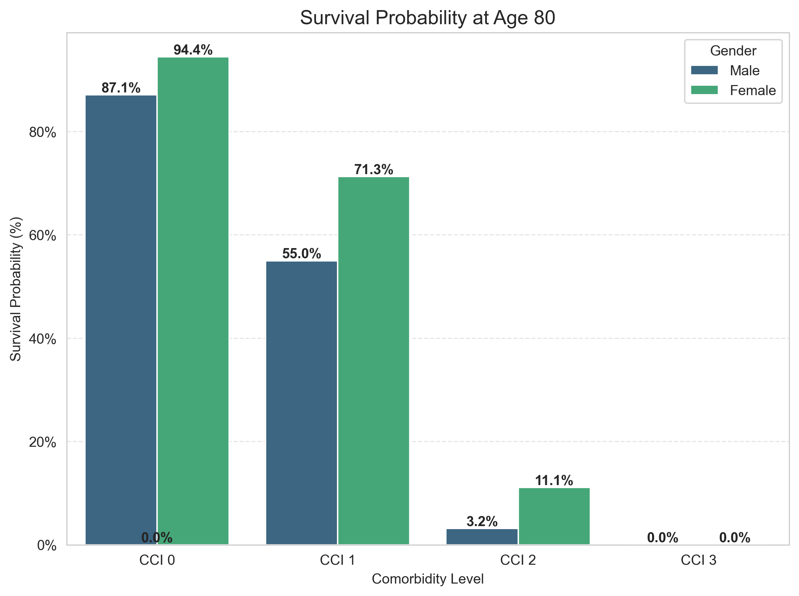

# ✨ Mortality Study  

## 📂 Data Description  

### 1️⃣ Files Overview  

The dataset consists of **two separate files**, one for men and one for women. Each file is structured to provide comprehensive mortality statistics categorized by **age** and **comorbidity level**.  

Each row in the dataset represents a **specific age**, ranging from **18 to 99 years**, leading to a total of **82 rows per file**. Since we maintain separate datasets for men and women, this results in an overall **164 rows** across both datasets. While this number may seem small, it encapsulates an extensive set of mortality insights derived from millions of real-world medical records.  

Additionally, a **centralized source server (`source_server`)** stores the **merged dataset**, including:
- The **SQL schema** defining the database structure.
- The **data inserts** containing all mortality records.
- Various **utilities** facilitating dataset maintenance and updates.

This **source server** acts as the primary repository before data is distributed to gender-specific servers.  

### 2️⃣ Variables Definition  

Each row in the dataset contains a set of variables that provide detailed mortality-related metrics, stratified by different levels of comorbidities:  

| Variable     | Description                                               |
|--------------|-----------------------------------------------------------|
| Age          | Age in years (18 to 99)                                   |
| CCI0         | Mortality rate with no comorbidity                        |
| SxFict_FCCI0 | Survival order with no comorbidity                        |
| EV_CCI0      | Life expectancy with no comorbidity                       |
| CCI1         | Mortality rate with a low level of comorbidity            |
| SxFict_FCCI1 | Survival order with a low level of comorbidity            |
| EV_CCI1      | Life expectancy with a low level of comorbidity           |
| CCI2         | Mortality rate with an intermediate level of comorbidity  |
| SxFict_FCCI2 | Survival order with an intermediate level of comorbidity  |
| EV_CCI2      | Life expectancy with an intermediate level of comorbidity |
| CCI3         | Mortality rate with a high level of comorbidity           |
| SxFict_FCCI3 | Survival order with a high level of comorbidity           |
| EV_CCI3      | Life expectancy with a high level of comorbidity          |

These variables are consistently structured for both **men** and **women**, ensuring seamless comparative analyses across the two datasets.  

### 3️⃣ Population and Study Period  

The dataset is extracted from the **Échantillon Généraliste des Bénéficiaires (EGB)**, a comprehensive, representative sample derived from the **Système National des Données de Santé (SNDS)**. Although the dataset comprises only **164 aggregated rows**, it is based on the medical histories of **millions of individuals**, ensuring a **robust and reliable foundation** for mortality analysis.  

This study focuses on individuals who meet the following criteria:
- **Aged 18 or older** at the time of analysis.
- **Residing in mainland France**, explicitly excluding Corsica and overseas territories.
- **Included in mortality trends spanning 2011 to 2018**, offering a multi-year perspective on mortality evolution.

### 4️⃣ Measuring Comorbidities  

To assess the health status of individuals, we utilize the **Charlson Comorbidity Index (CCI)**, a widely recognized metric for evaluating comorbidities. Based on this index, individuals are classified into four distinct categories:

- 🟢 **CCI = 0** → No comorbidity.
- 🟡 **0 < CCI < 3** → Low comorbidity level.
- 🟠 **3 ≤ CCI < 5** → Intermediate comorbidity level.
- 🔴 **CCI ≥ 5** → High comorbidity level.

Comorbidities are identified through multiple data sources, including:
- **Hospital discharge diagnoses (ICD-10 coding).**
- **Long-term illness classifications (ALD).**
- **Prescription drug consumption patterns.**
- **Records of specific medical procedures.**

The comorbidity level is determined using a **12-month rolling window** methodology:
- If the individual is deceased, their final **12 months of medical history** are analyzed.
- If the individual was still alive in 2018, a **random reference date within that year** is selected to ensure unbiased assessment.  

---

## 🏗️ Why and How We Segmented the Data  

### 1️⃣ Why Was the Data Split?  

Segmenting the dataset was a deliberate choice influenced by three crucial factors:

- **Performance Optimization** 🚀: Reducing the dataset's operational size leads to **faster query execution** and **lower computational costs**.
- **Analytical Precision** 🎯: Mortality patterns exhibit significant variations across **genders** and **age groups**. By separating the data, we **minimize biases** and enable more precise comparisons.
- **Scalability and Maintainability** 📊: This structured approach ensures seamless integration of future **additional years**, **expanded comorbidity classifications**, and **finer-grained mortality factors**.  

### 2️⃣ Centralized Source Server  

Before splitting the dataset by gender, all data is initially stored on the **source server (`source_server`)**, which serves as the **primary data repository**. This server:
- Houses the **full dataset**, containing merged records from men and women.
- Stores the **SQL schema** defining tables, indexes, and relationships.
- Contains **data insertion scripts** for reloading and updating the dataset.
- Provides **utility functions** for maintaining and querying the mortality database.

This **centralized storage approach** ensures that gender-based datasets remain synchronized and facilitates easy updates when additional data becomes available.  

### 3️⃣ Gender-Based Data Distribution  

To enhance processing efficiency and facilitate **independent gender-based analyses**, the dataset is stored across **two separate database servers**:

- **Men’s data** is housed on `men_server`.
- **Women’s data** is housed on `women_server`.

Each database maintains an **identical structure**, allowing parallel processing, streamlined comparisons, and gender-specific mortality trend analysis.  

### 4️⃣ Age-Based Data Organization for Granular Analysis  

Beyond gender-based segmentation, the dataset is further structured to enable refined age-specific analyses. Mortality trends and life expectancy projections vary significantly across different age groups, necessitating more detailed breakdowns.  

To achieve this, data is categorized into three primary **age brackets**:
- **Young Adults (Below 41 years old)** → Capturing early adulthood mortality patterns.
- **Middle-Aged Individuals (41 to 65 years old)** → Focusing on mid-life health dynamics.
- **Elderly Population (Above 65 years old)** → Analyzing senior mortality risk factors.

This segmentation enhances analytical depth by:
- **Facilitating precise mortality rate calculations** tailored to each age group.
- **Enabling targeted statistical assessments** to identify risk patterns more effectively.
- **Accelerating data queries** by focusing on age-specific subsets rather than the entire dataset.  

### 5️⃣ Summary of Data Segmentation Benefits  

✔️ **Centralized data storage** with a structured source repository.  
✔️ **Enhanced computational efficiency** through structured dataset partitioning.  
✔️ **Higher accuracy** by isolating gender and age-based variations in mortality.  
✔️ **More meaningful insights** via targeted and structured data organization.  

This approach ensures **maximal efficiency, clarity, and depth** in mortality research. ✨  

---

## 🔎 Analysis and Visual Insights

### 1️⃣ Life Expectancy Falls Sharply with Comorbidity Severity – Gender Matters Too

This chart illustrates how life expectancy changes with age across four Charlson Comorbidity Index (CCI) categories (CCI 0 to CCI 3), separately for men (solid lines) and women (dashed lines). Several patterns emerge:

- **Effect of Comorbidity Burden**  
   Individuals at CCI 0 have substantially higher life expectancy compared to those at CCI 3. For instance, at age 20, those with CCI 0 can expect to live well into their 80s or beyond, while those at CCI 3 typically have fewer than 10 additional years. This large gap underscores the impact of chronic disease burden on survival.

- **Age Gradient**  
   The slope of each curve becomes steeper with advancing age, indicating an accelerating decline in remaining life years. This acceleration is more pronounced in higher CCI levels, where the curve drops sharply as age increases.

- **Gender Differences**  
   Across most CCI levels, women maintain a slight survival advantage over men. However, at higher comorbidity levels (CCI 2 and CCI 3), this gap narrows, suggesting that severe comorbidity diminishes or offsets gender-based survival benefits.

- **Comparison at Midlife**  
   Around age 40, individuals at CCI 0 can still expect multiple decades of life (often 50+ years), whereas those at CCI 3 typically have fewer than 10 remaining years. This stark contrast points to the potential benefits of early prevention and effective management of chronic conditions in midlife.

- **Convergence at Older Ages**  
   After approximately age 90, all curves converge at low remaining life expectancy. By this point, even those with minimal comorbidity approach a similar limit to those with higher burdens, reflecting the overall biological constraints at very advanced ages.

In summary, the data suggest that preventing or reducing comorbidity can substantially extend life expectancy, especially among adults under 70. The persistent though variable gender gap invites further investigation into possible factors, including differences in healthcare utilization, disease profiles, and lifestyle behaviors.

---

### 2️⃣ Simulated Life Expectancy Gains from Reducing Comorbidities

This updated chart shows the estimated **life expectancy gains** when individuals reduce their comorbidity levels—from higher Charlson Comorbidity Index (CCI) categories to lower ones (e.g., **CCI 3 → CCI 0**, **CCI 3 → CCI 2**, **CCI 2 → CCI 1**, **CCI 1 → CCI 0**). Solid lines represent **men**, while dashed lines represent **women**. Several patterns emerge:

- **Largest Gains from Severe to Minimal Comorbidity**  
  Moving from **CCI 3** (high level) to **CCI 0** (no comorbidity) yields the most dramatic increase in remaining years, especially for younger adults. For instance, a 20-year-old man could gain up to **36 additional years**, while a woman of the same age might gain around **34 years**.

- **Midlife Advantage**  
  Although the largest absolute gains occur at younger ages, adults in their **40s and 50s** still stand to benefit substantially. Even reducing comorbidity by just one level (e.g., **CCI 2 → CCI 1**) can add **10+ years** of life at age 40.

- **Elderly Benefits**  
  At older ages (e.g., 80+), the curves taper, but gains remain meaningful. A shift from **CCI 3** to **CCI 0** can still yield an extra **2–3 years** at age 90, underscoring the potential value of late-life interventions.

- **Gender Differences**  
  Men generally show **slightly larger gains** at younger ages—possibly reflecting higher baseline mortality risk—while women’s gains are marginally lower but remain consistent across the lifespan. The gender gap narrows with advancing age, as both groups approach similar upper limits in life expectancy.

- **Non-linear Effects**  
  Reductions from **severe** to **moderate** comorbidity (e.g., **CCI 3 → CCI 2**) produce **bigger jumps** than from **mild** to **no** comorbidity (e.g., **CCI 1 → CCI 0**). This suggests that **earlier and more aggressive** management of chronic conditions can yield proportionally larger dividends in longevity.

In short, **even modest reductions in comorbidity can yield considerable life expectancy benefits**, with **younger and middle-aged adults** reaping the largest absolute gains. These findings reinforce the importance of **preventive care, early detection, and effective treatment** strategies to slow or reverse the progression of chronic diseases.

---

### 3️⃣ Mortality Rate Comparison by Gender at Equal Age and CCI

Even with **identical age and comorbidity levels**, **men exhibit higher mortality rates** than women.

#### Age-Specific Comparisons:

  

  

  

  ~~

- **Key Insight**:
  - **Relative mortality risk** for men is **20–30% higher** than for women, across all ages.
  - The **gap is widest** in **younger adults** and **narrows with age**, possibly due to **selective survival**.

**Possible Explanations**:
- **Biological**: Hormonal differences (e.g., estrogen’s protective effects).
- **Behavioral**: Higher risk-taking and lower healthcare engagement among men.
- **Social**: Differential access to care or adherence.

---

### 4️⃣ Survival Profiles Over Time: Impact of Age, Gender, and CCI

  

  

  

  

### 🔹 Survival Probability Declines Sharply with Higher CCI  

- Across all age groups, **higher comorbidity levels (CCI 3)** lead to a **dramatic decline in survival probability** over time.  
- At age **20**, the difference between CCI 0 and CCI 3 is already visible, but at age **40+**, CCI 3 individuals face **severe survival disadvantages**, often seeing survival probabilities fall below 30% within just a few decades.  

### 🔹 The "Aging Effect" of Comorbidities  

- The survival probability of **a 40-year-old with CCI 3** is comparable to that of an **80-year-old with CCI 0**.  
- This suggests that **severe comorbidity burden accelerates aging effects**, effectively reducing an individual's survival chances to that of someone decades older with no chronic conditions.  

### 🔹 Gender-Based Differences in Survival Profiles  

- **Men’s survival probability declines more rapidly than women’s** at every comorbidity level.  
- Even at **CCI 0**, men see a **steeper drop in survival probability** than women, reinforcing the idea that gender-based biological and behavioral factors play a critical role.  
- At **CCI 3**, however, the survival disadvantage for men becomes less pronounced over time, suggesting that in extreme cases of comorbidity, survival is more dictated by disease burden than gender.  

### 🔹 Implications for Public Health  

- **Preventing the progression to high comorbidity states (CCI 3) is key**—even moderate reductions in disease burden significantly improve long-term survival prospects.  
- **Targeted interventions in midlife (40–60 years)** could offer the most significant gains in survival.  
- **Gender-sensitive health policies** should be considered, with a focus on early detection and lifestyle interventions, particularly for men, to mitigate their higher mortality risk.  

---

## 🧩 Conclusion

This analysis illustrates that **comorbidities exert a profound influence on mortality and life expectancy**, shaping outcomes far more than age alone. The **Charlson Comorbidity Index (CCI)** emerges as a critical determinant, with **each additional burden translating into years of life lost**. 

Importantly, **men face a consistent mortality disadvantage**, suggesting an urgent need for **targeted health policies** addressing **gender disparities**. 

Our simulations highlight that **reducing comorbidities—even modestly—can yield substantial longevity benefits**, particularly when action is taken in **middle adulthood**. This underscores the strategic importance of **early chronic disease prevention, improved access to care, and patient engagement**.

In a rapidly aging society, **preventing and mitigating comorbidity** is not only a **clinical priority** but also a **public health imperative**. Effective management has the potential to **enhance individual life quality**, **extend survival**, and **alleviate systemic healthcare burdens**—a win-win outcome for all stakeholders.